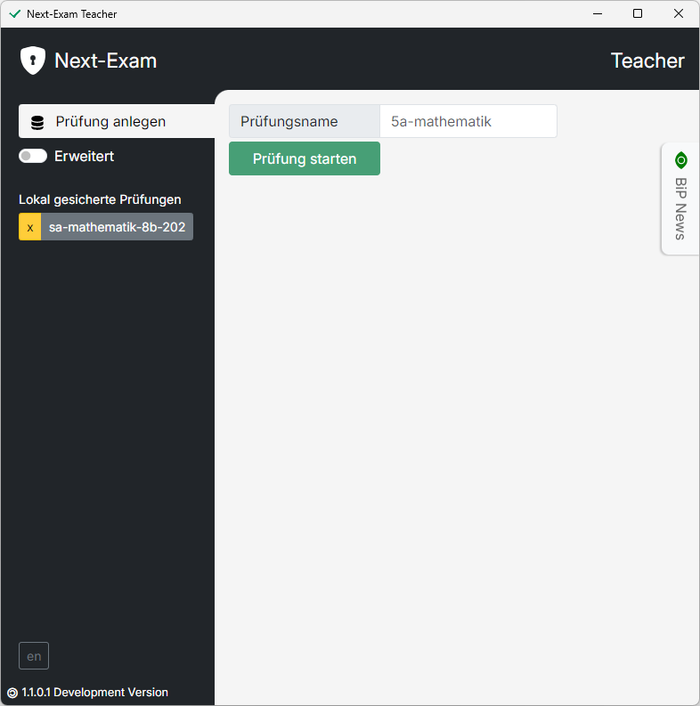
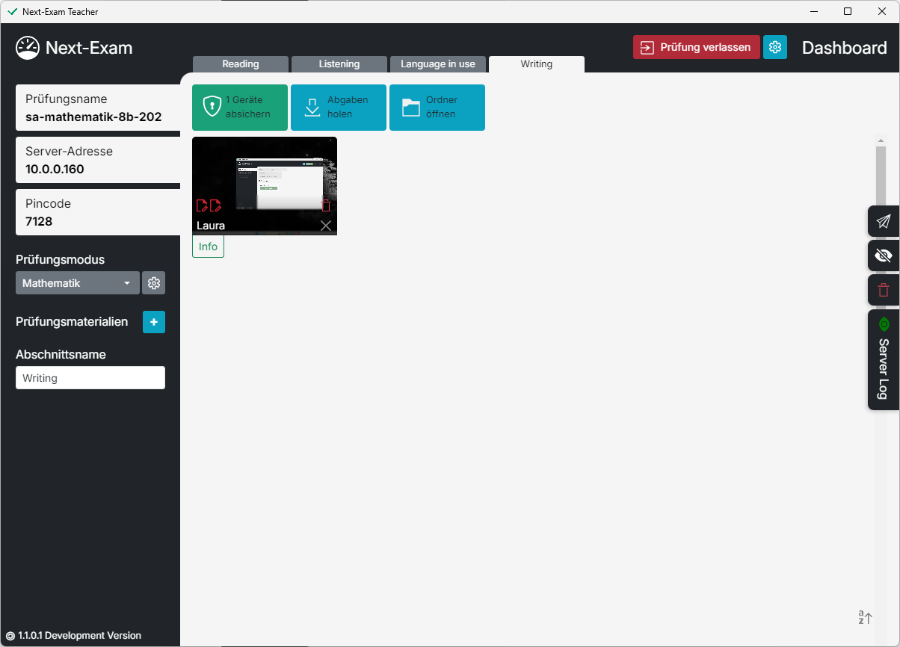
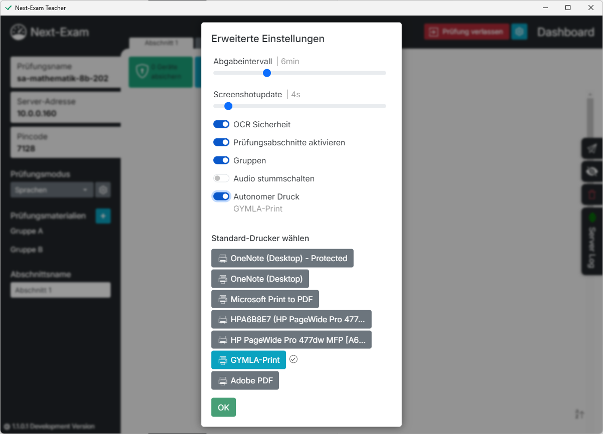

# Erweiterte Funktionen
<figure markdown="span">
    {width="50%"}
    <figcaption>Erweiterte Funktionen am Dashboard **vor Prüfungsstart**</figcaption>
</figure>

## Lokal gesicherte Prüfungen löschen bzw. fortsetzen
Next-Exam sichert jede Prüfung im Arbeitsordner "EXAM-TEACHER" und speichert darin alle Schülerarbeiten sowie die Exam-Konfiguration.
Ein Klick auf das `x`-Symbol (*gelb hinterlegt*) löscht die lokale Sicherung der Prüfung. Mit einem Klick auf den Prüfungsnamen wird die Sicherung aktiviert und kann fortgesetzt werden.

## Sprache der Benutzeroberfläche wählen

## Informationskanal vom Bildungsportal abrufen

<figure markdown="span">
    {width="50%"}
    <figcaption>Erweiterte Funktionen am Dashboard **nach Prüfungsstart**</figcaption>
</figure>

## Bildschirm abdunkeln
Abdunkeln des Bildschirms, um die Aufmerksamkeit zu lenken

## Erweiterte Prüfungseinstellungen
Über das `Zahnrad`-Symbol (*oben rechts*) Einstellungsfenster der Prüfung.
<figure markdown="span">
    {width="50%"}
    <figcaption>Erweiterte Funktionen in den Einstellungen</figcaption>
</figure>

### Gruppen verwalten
Aktivierung, Änderung der Gruppenzugehörigkeit oder Zuweisung gruppenspezifischer Materialien

### Prüfungsabschnitte
Für Sprachschularbeiten oder Tests, die in getrennte Bereiche unterteilt werden, können Prüfungsabschnitte aktiviert werden.

- Unterteilung der Prüfung in Abschnitte.
- Festlegung unterschiedlicher Bedingungen pro Abschnitt.

### Erweiterte Sicherheitsfunktionen

- Automatisches Abgabeintervall einstellen: Neben manueller Abgabe erfolgt die automatische Archivierung der Arbeiten
- Screenshot-Intervall einstellen
- OCR-Funktion aktivieren: Erkennung von Versuchen, die Prüfungsumgebung zu umgehen
- Automatische Bereinigung alter Arbeitsdateien: Bereinigung der Schülerordner beim Beenden der Prüfung
- Autonomer Druck: Gewährung des Zugriffs auf den am Prüfungsserver installierten Drucker

### Integration ins Bildungsportal

Mit dem kommenden Bildungsportal-Plugin können Prüfungen vorab konfiguriert, Materialien festgelegt und Teilnehmerlisten erstellt werden.

- Anbindung an das zentrale Bildungsportal
- Vorkonfigurierte BiP-Prüfungen

