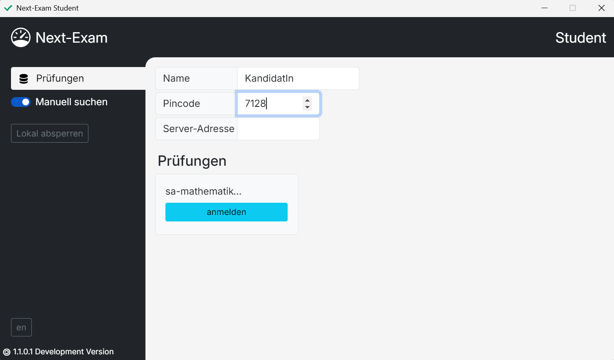
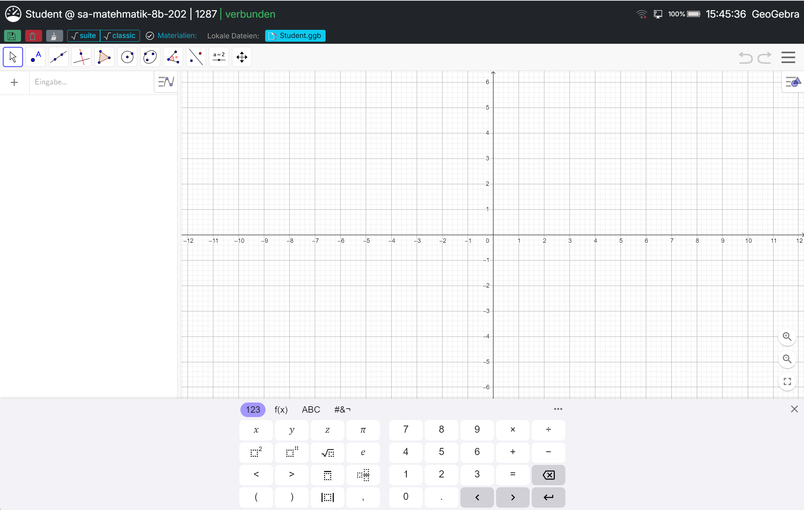
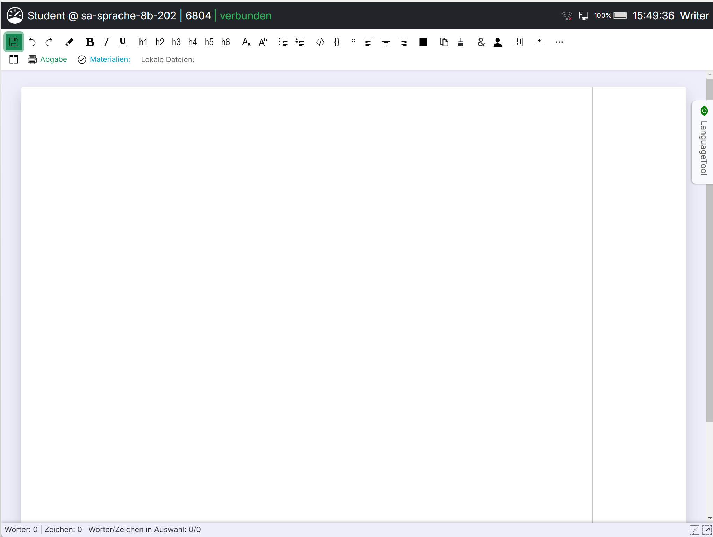
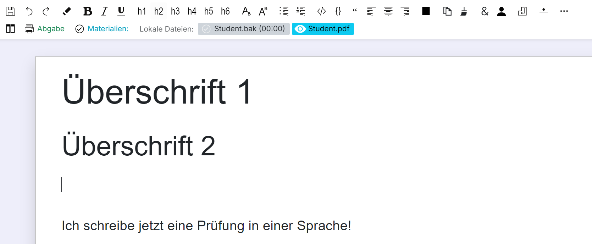
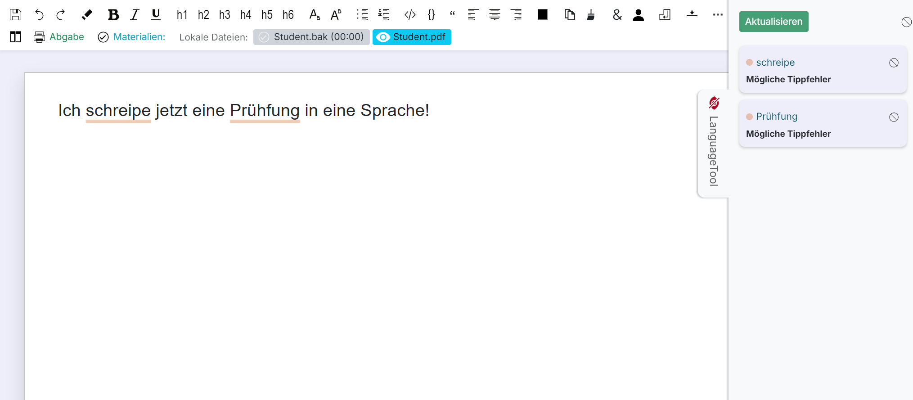
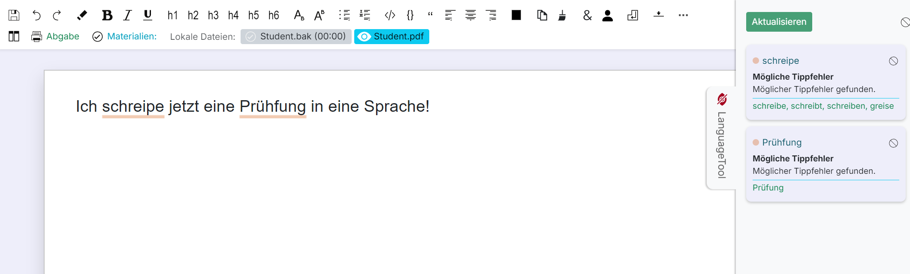

# Student - Grundlegende Funktionen

## Prüfung starten aus Sicht der Schüler:innen
In der Student-Version von Next-Exam werden im Netzwerk gefundene Prüfungen automatisch angezeigt. Diese können im Feld `Name` einen frei wählbaren, eindeutigen Benutzernamen angeben und dem `Pincode` des Teacher-Dashboards beitreten.
<figure markdown="span">
    {width="50%"}
    <figcaption>bei Prüfung anmelden</figcaption>
</figure>

### Verbindung mit dem Prüfungsserver herstellen
Durch Klick auf die Schaltfläche `anmelden` wird die Verbindung zum Prüfungsserver hergestellt.
Sollte die Prüfung nicht automatisch in der Student-Version erscheinen, kann über den Schieber `Manuell suchen` das Feld `Server-Adresse` eingeblendet werden und die Adresse entsprechend dem Teacher-Dashboard eingegeben werden.

## Prüfung starten
Wird `Geräte absichern` durch die korrespondierende Teacher-Version ausgeführt, werden die verbundenen Student-Geräte in den Prüfungsmodus versetzt.

## Prüfung durchführen
> In der Teacher-Version von Next-Exam können unterschiedliche Prüfungsmodi gewählt werden. Dementsprechend ändert sich auch die Oberfläche der Student-Version beim Durchführen der Prüfung.

### Mathematik-Prüfung durchführen
Wird eine Mathematik-Prüfung gestartet, steht in der Student-Version eine abgesicherte Version von GeoGebra® zur Verfügung.
<figure markdown="span">
    {width="50%"}
    <figcaption>Mathematikprüfung mit GeoGebra®</figcaption>
</figure>

#### GeoGebra® Version wechseln
> Mit den Schaltflächen `Suite` und `Classic` kann in die gewünschte Version von Geogebra gewechselt werden.

### Sprachen-Prüfung durchführen
Wird eine Sprachen-Prüfung gestartet, öffnet sich in der Student-Version ein abgesicherter Texteditor.
<figure markdown="span">
    {width="50%"}
    <figcaption>LanguageTool ohne Vorschläge</figcaption>
</figure>

#### Text verfassen
Der Texteditor stellt über die Symbolleiste Formatierungsmöglichkeiten und Befehle bereit.
<figure markdown="span">
    {width="50%"}
    <figcaption>LanguageTool ohne Vorschläge</figcaption>
</figure>

> Folgende Optionen können über die Symbolleiste erreicht werden:

- `sichern` - Symbol ... speichert den aktuellen Text ab.
- `rückgängig` - Symbol ... widerruft die letzte Änderung.
- `wiederherstellen` - Symbol ... stellt widerrufene Änderungen wieder her.
- `löschen` - Symbol ... entfernt den markierten Text.
- `fett`, `kursiv`, `unterstrichen` - Symbole ... stellen die Schrift auf die entsprechenden Formatierungen um.
- `h1` ... `h6` - Symbole ... wenden die entsprechenden Formatvorlagen für Überschriften an.
- `hochstellen`, `tiefstellen` - Symbole ... stellen die Schrift auf die entsprechenden Formatierungen um.
- `ungeordnete Liste`, `geordnete Liste` - Symbole ... versehen Absätze mit Aufzählungszeichen bzw. Nummerierungen.
- `code` - Symbole ... formatieren speziell für HTML- oder Programmiercode-Bereiche.
- `linksbündig`, `zentriert`, `rechtsbündig` - Symbole ... beeinflussen die Textausrichtung.
- `Textfarbe` - Symbol ... passt die Farbe des Textes an.

#### Rechtschreibhilfe
Wenn in der Teacher-Version `LanguageTool aktivieren` angehakt wurde, erscheint in der Student-Version der entsprechende Seitenbereich, über den Rechtschreibhilfen in Anspruch genommen werden können.

##### LanguageTool
> Wurde lediglich `LanguageTool aktivieren` in der Teacher-Version angehakt, werden mögliche Rechtschreibfehler angezeigt.
<figure markdown="span">
    {width="50%"}
    <figcaption>LanguageTool ohne Vorschläge</figcaption>
</figure>

##### LanguageTool mit Vorschlägen
> Wurde `LanguageTool aktivieren` und `Vorschläge anzeigen` in der Teacher-Version angehakt, werden mögliche Rechtschreibfehler und entsprechende Verbesserungsvorschläge angezeigt.
<figure markdown="span">
    {width="50%"}
    <figcaption>LanguageTool mit Vorschlägen</figcaption>
</figure>
