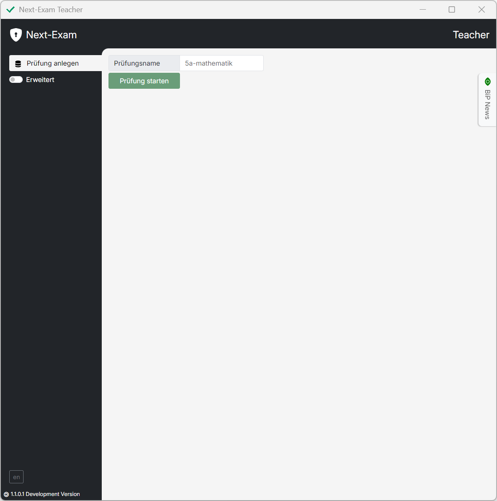
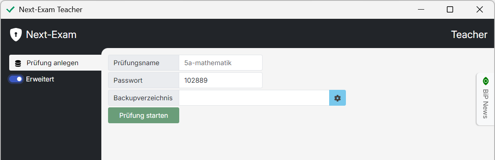
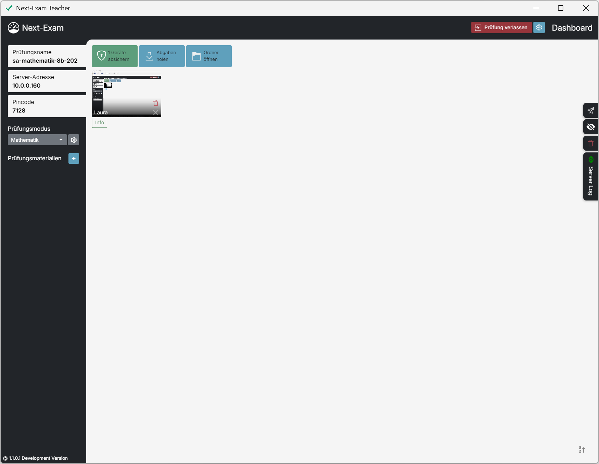
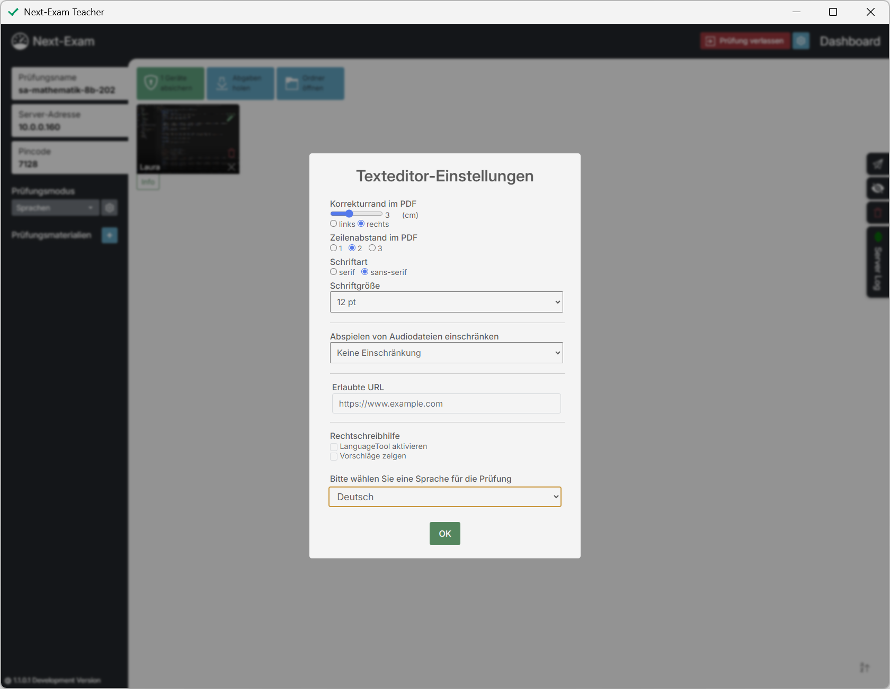
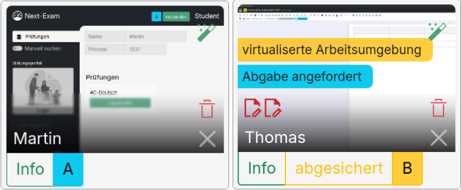

# Teacher - Grundlegende Funktionen

## Prüfungen anlegen
> Der `Prüfungsname` kann frei gewählt werden. Der Arbeitsordner am Desktop beinhaltet alle archivierten Arbeiten und Abgaben sowie die Prüfungsordner und die Prüfungs-Konfiguration.
<figure markdown="span">
    {width="50%"}
    <figcaption>Prüfung anlegen, Prüfungsserver starten</figcaption>
</figure>

### Passwort festlegen (optional)
> Ein `Passwort` kann festgelegt werden um zu verhindern, dass die Prüfung bei Verbindungsverlust vom Student verlassen werden kann.

### Backup-Ordner festlegen (optional)
> Das zusätzliche `Backupverzeichnis` kann individuell gewählt werden (z.B. Netzwerk-Ordner, USB Stick, ...). Hier werden die Prüfungsdaten (Arbeiten der Schüler:innen, Konfiguration, ...) zusätzlich zum oben genannten Arbeitsordner abgelegt.
<figure markdown="span">
    {width="50%"}
    <figcaption>Passwort, Backupverzeichnis</figcaption>
</figure>

## Dashboard
Das Teacher-Dashboard bietet eine Übersicht über alle verbundenen Schüler:innen und stellt alle prüfungsrelevanten Informationen dar.
Es ermöglicht die Konfiguration der Prüfung und die Verwaltung der Schüler:innen.

<figure markdown="span">
    {width="50%"}
    <figcaption>Dashboard</figcaption>
</figure>

Der automatisch generierte `Pincode` wird von den Schüler:innen benötigt, um der Prüfung beizutreten.
Sollte die Prüfung bei den Schüler:innen nicht aufscheinen, können sie die Prüfung durch Eingabe der `Server-Adresse` finden.

## Prüfungsmodi
> Next-Exam ermöglicht viele verschiedene Prüfungsvarianten. 

<figure markdown="span">
    {width="50%"}
    <figcaption>Prüfungsmodi</figcaption>
</figure>

Verfügbare Prüfungsmodi sind:

- `Mathematik` - ... mit GeoGebra-Integration
- `Sprachen` - Texteditor mit erweiterten Features
- `Eduvidual/Moodle` - LMS-Test im Kiosk-Mode
- `Google Forms` - Formular im Kiosk-Mode
- `Microsoft 365` - online-Versionen von Word, Excel usw.
- `Website` - Website im Kiosk-Mode

> Der Prüfungsmodus kann im Dropdown-Feld `Prüfungsmodus` gewählt werden. Je nach Prüfungsmodus erscheint ein Konfigurationsfenster. Im Nachhinein kann die Prüfungskonfiguration jederzeit über das Zahnrad-Symbol (oben rechts) geöffnet werden.

### Sprachen

<figure markdown="span">
    {width="50%"}
    <figcaption>Prüfungsmodus "Sprachen" - Konfiguration</figcaption>
</figure>

> Einstellungen wie Korrekturrand, Schriftart, Zeilenabstand und Schriftgröße betreffen sowohl die Darstellung im Editor als auch die Erstellung des Ablage-PDF. Audiodateien (Anzahl erlaubter Abspielversuche) können eingeschränkt werden. Zusätzliche Hilfsmittel in Form von Webseiten (z.B. Wörterbuch) lassen sich definieren. Eine passive Rechtschreibhilfe über das `LanguageTool` kann aktiviert und konfiguriert werden.

### Mathematik
>In diesem Modus arbeiten die Schüler:innen mit GeoGebra Classic/Suite. Zusätzliche Hilfsmittel, wie eine Formelsammlung über eine Webseite, können gesetzt werden.

### Eduvidual/Moodle
Next-Exam übernimmt die Absicherung des Moodle-Tests. Alle nötigen Einstellungen für die Prüfungsumgebung erfolgen über Moodle selbst.

### Webseiten
Eine beliebige Webseite kann in diesem Modus angezeigt und abgesichert werden. Z.B. digi4school.at, lms.at, scratch.mit.edu, ...

### Google Forms
Google Forms können in diesem Modus angezeigt und abgesichert werden.

### Microsoft365
Nach dem Login mit Microsoft365 wird ein .docx bzw. .xlsx-Template bereitgestellt.
Aus diesem Template werden für jede:n Schüler:in automatisch Kopien im OneDrive der Lehrperson generiert, inklusive individueller "Share-Links" zur Bearbeitung.

### RDP
Über das Remote Desktop Protocol (RDP) kann auf einen Windows-Server (oder Virtuelle Maschine) zugegriffen werden.
>Als Lehrperson muss man den Domainnamen (fqdn) des RDP Servers angeben. Die Schüler:innen erhalten dann einen Login-Screen und können sich mit ihrem Domänenbenutzer einloggen und arbeiten.  
>Am Windows Server muss der RD Web Client installiert sein!

## Prüfung starten
Der grüne Button am Dashboard 'Geräte absichern' startet die Prüfung. Die Endgeräte der Schüler:innen wechseln in den abgesichterten Modus.

## Prüfungsunterlagen
### Prüfungsmaterialien bereitstellen
>Auswahl der zugänglichen Materialien (Textdokumente, PDFs, Formelsammlungen, Wörterbücher, Audiodateien, Bilder)
### Gruppen- und Einzelschüler-Zuweisung
Die benötigten Materialien werden den Clients in Base64-Codierung bereitgestellt und nicht lokal gespeichert.
Samtliche Materialien können auch während der laufenden Prüfung geändert, betrachtet, ggf. abgespielt (audio) oder entfernt werden.

### Dateien bereitstellen
Das Next-Exam System bietet mehrere Optionen, um Dateien dem Anlass entsprechend zu versenden.
>Über die Sidebar im Dashboard können Dateien im Original an alle Schüler:innen gleichzeitig gesendet werden. Über die Schaltflächen im Dateimanager können Backups an einzelne Schüler:innen gesendet werden. Diese Dateien liegen dann im Arbeitsordner der Schüler:innen und können auch im abgesicherten Modus genutzt werden (an alle bzw. an einzelne Schüler:innen während der Prüfung (z.B. für Zwischenstände, Nachteilsausgleich)).

### Sicherungen zurücksenden
Der Dateimanager ermöglicht es, eine Datei direkt auszuwählen und an einzelne Schüler:innen zu senden. Diese Funktion wird u.a. bei .bak Dateien (Sicherungsdateien des Editors) genutzt.

## Schüler verwalten
### Sitzplan
Das Dashboard ist gleichzeitig der Sitzplan. Er zeigt die aktuelle Position der Schüler:innen im Raum an. Diese können per Drag&Drop verändert werden.
### Student-Widget
Über das "Student-Widget" können die Einstellungen für einzelne Schüler:innen bearbeitet werden.
<figure markdown="span">
    {width="50%"}
    <figcaption>Student-Widgets</figcaption>
</figure>
- Die Schaltfläche `Info` öffnet die Detailansicht der Schüler:innen.
> Schüler:innen können dort freigeschaltet bzw. aus der Prüfung entfernt, Dateien an einzelne Schüler:innen versendet oder Abgaben verwaltet werden.
- Falls der Gruppenmodus in den Prüfungseinstellungen aktiviert wurde, können Über die Schaltflächen `A` / `B` die Schüler:innen den gewünschten Gruppen zugewiesen werden.
- Die Schaltfläche `X` beendet die Prüfung für die jeweiligen Person.
- Der `Papierkorb` bereinigt den Arbeitsordner am PC der jeweiligen Schüler:innen.
- Der `Zauberstab` erlaubt es einzelnen Schüler:innen die Rechtschreibhilfe zu aktivieren.
- Die roten `Dokumenten-Symbole` geben über die Anzahl der Dateien, die Schüler:innen in ihrem Arbeitsordner erstellt haben, Auskunft.

Weitere Symbole und Schaltflächen werden in folgenden Fällen angezeigt:

- Schüler:in versendet Abgabe
- Schüler:in versucht eine `Virtualisierte Arbeitsumgebung` zu nutzen
- Schüler:in hat die Prüfung verlassen

## Abgaben einsehen und sichern
Der Dateimanager (Schaltfläche `Ordner öffnen` am Dashboard) erlaubt es den Lehrpersonen, alle Abgaben sowie archivierte Zwischenstände einzusehen und zu verwalten.
<figure markdown="span">
    {width="50%"}
    <figcaption>Dateimanager</figcaption>
</figure>
Folgende Aktionen sind im Dateimanager durchführbar:
#### Verwaltung der Prüfungsabgaben:
- Überwachung des Schülerfortschritts
- Einsicht, Archivierung und Download von Abgaben
- Automatische Archivierung mit Timestamp
- Zusammenfassung der neuesten Abgaben als PDF (mit Index: Name, Abgabezeitpunkt, Zeichenanzahl)
#### Abgabe:
- Finale Abgabe mit Nummerierung und Namen
- Direkter Versand der Dokumente an den Teacher
- Automatische Ablage im Ordner "ABGABE"
#### Direktdruck:
- Möglichkeit für Schüler:innen, ihre Arbeit direkt zu drucken
- Auswahl eines Standarddruckers

## Prüfung beenden
Die Prüfung kann über die rote Schaltfläche am Dashboard `Gerät freigeben` beendet werden. Damit wird der abgesicherte Modus bei den Schüler:innen beendet. Am PC der Schüler:innen erscheint die Meldung "*Wollen Sie die Anwendung Next-Exam beenden?*".